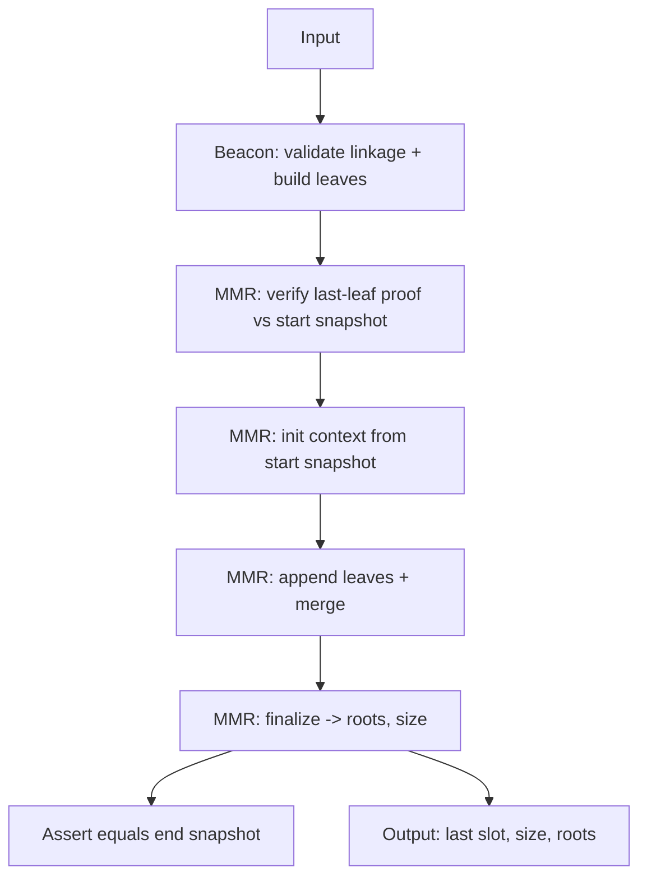

## Beacon + MMR Cairo Architecture (Proposed)

### Objectives
- **Isolation**: Keep beacon-chain logic separate from generic MMR logic so other chains can plug in without MMR changes.
- **Single responsibility**: Chain modules produce and validate leaves; MMR modules only manage MMR state, proofs, and roots.
- **Deterministic flow**: Clear orchestration in `main` with explicit inputs/outputs.

### High-level Flow
1. **Parse input** (headers, `start_mmr_snapshot`, `end_mmr_snapshot`, `last_leaf_proof`).
2. **Beacon module**: Validate header linkage and compute leaf hashes for both MMRs.
3. **MMR module**: Verify the last-leaf proof against `start_mmr_snapshot`.
4. **MMR module**: Initialize context from `start_mmr_snapshot` and append the newly produced leaves.
5. **MMR module**: Finalize, producing new roots and size. Assert they match `end_mmr_snapshot`.
6. **Output**: latest slot, final MMR size, Poseidon root, Keccak root.



### Module Layout (Proposed)
- `src/beacon/`
  - `main.cairo`: Orchestrates end-to-end flow using public APIs.
  - `headers.cairo`: Beacon-specific validation and leaf building.
  - `proofs.cairo`: Beacon-specific wrapping (if needed) around generic MMR last-leaf assertion.
- `src/mmr/`
  - `api.cairo`: Public MMR API surface (purely generic).
  - `types.cairo`: Existing types + new context/output structs (generic).
  - `leaf_hash.cairo`: Existing chain-agnostic leaf hashing primitives.
  - `build.cairo`: Construction primitives (`construct_mmr`, `merge_subtrees_if_applicable`).
  - `utils.cairo`: Existing helpers (heights, peak positions, bagging, subtree path hashers, etc.).

Notes:
- Remove any `%{ program_input ... }` parsing from MMR code. Parsing stays in `beacon`.
- Keep `utils.cairo` purely generic and reusable across chains.

### Public APIs (Proposed Signatures)

Beacon domain

```cairo
// Validate linkage and compute leaves for both hash functions.
func build_beacon_leaves{
    range_check_ptr,
    bitwise_ptr: BitwiseBuiltin*,
    keccak_ptr: KeccakBuiltin*,
    poseidon_ptr: PoseidonBuiltin*,
}(
    previous_root: Uint256,
    headers: BeaconHeader*,
    count: felt,
) -> (
    poseidon_leaves: felt*,
    keccak_leaves: Uint256*,
    last_slot: felt,
    last_header_root: Uint256,
);
```

MMR generic API

```cairo
// Validate a snapshot by recomputing roots from its own peaks.
func assert_snapshot_roots{
    range_check_ptr,
    bitwise_ptr: BitwiseBuiltin*,
    keccak_ptr: KeccakBuiltin*,
    poseidon_ptr: PoseidonBuiltin*,
    pow2_array: felt*,
}(snapshot: MmrSnapshot);

// Prepare a working context from a snapshot (offset, dicts, arrays).
func init_mmr_context{
    range_check_ptr,
    bitwise_ptr: BitwiseBuiltin*,
    keccak_ptr: KeccakBuiltin*,
    poseidon_ptr: PoseidonBuiltin*,
    pow2_array: felt*,
}(
    snapshot: MmrSnapshot,
) -> (ctx: MmrContext);

// Append leaves and perform necessary merges.
func append_mmr_leaves{
    range_check_ptr,
    bitwise_ptr: BitwiseBuiltin*,
    keccak_ptr: KeccakBuiltin*,
    poseidon_ptr: PoseidonBuiltin*,
    pow2_array: felt*,
}(
    ctx: MmrContext*,
    poseidon_leaves: felt*,
    keccak_leaves: Uint256*,
    n_leaves: felt,
);

// Compute roots and size from the context (without destroying it).
func finalize_mmr{
    range_check_ptr,
    bitwise_ptr: BitwiseBuiltin*,
    keccak_ptr: KeccakBuiltin*,
    poseidon_ptr: PoseidonBuiltin*,
    pow2_array: felt*,
}(
    ctx: MmrContext*,
) -> (roots: MmrRoots, size: felt);

// Check computed state matches provided expected end snapshot.
func assert_end_snapshot_matches{
    range_check_ptr,
}(
    roots: MmrRoots,
    size: felt,
    expected: MmrSnapshot,
);

// Verify a last-leaf inclusion proof resolves to a peak that is actually
// present in the snapshot's peaks (by position and value) and that the leaf
// is the last leaf under the rightmost peak for the snapshot size.
func assert_last_leaf_proof{
    range_check_ptr,
    bitwise_ptr: BitwiseBuiltin*,
    keccak_ptr: KeccakBuiltin*,
    poseidon_ptr: PoseidonBuiltin*,
    pow2_array: felt*,
}(
    snapshot: MmrSnapshot,
    proof: LastLeafProof,
);
```

### Types (Proposed)

```cairo
// Already present, keep as is; ensure peaks arrays are left-to-right.
struct MmrSnapshot {
    size: felt,
    poseidon_root: felt,
    keccak_root: Uint256,
    peaks_len: felt,
    poseidon_peaks: felt*,
    keccak_peaks: Uint256*,
}

// For MMR building session derived from a snapshot.
struct MmrContext {
    // not owning pointers to arrays (allocated by init)
    mmr_array_poseidon: felt*,
    mmr_array_keccak: Uint256*,
    mmr_array_len: felt,
    mmr_offset: felt,
    // dictionaries mapping previous peak position -> value
    previous_peaks_dict_poseidon: DictAccess*,
    previous_peaks_dict_keccak: DictAccess*,
}

// Final roots container.
struct MmrRoots { poseidon: felt, keccak: Uint256 }

// Last-leaf proof used to assert no gaps between snapshots and new headers.
struct LastLeafProof {
    header_root: Uint256,
    header_position: felt,
    path_len: felt,
    poseidon_path: felt*,
    keccak_path: Uint256*,
}
```

### Last-Leaf Proof Verification (Generic)
Goal: show the provided `header_root` is the last leaf of the entire MMR of size `snapshot.size`, and that the resulting peak exists in `snapshot` at the corresponding peak position.

Steps:
- Compute `poseidon_leaf = Poseidon(header_root.low, header_root.high)` and `keccak_leaf = Keccak(header_root)`.
- Use `hash_subtree_path_poseidon`/`hash_subtree_path_keccak` to get `(peak_value, peak_pos, peak_height)` for both.
- Call `assert_is_last_leaf_in_mmr(snapshot.size, position=header_position)`.
- Compute all `peaks_positions` with `compute_peaks_positions(snapshot.size)` and find index `i` where `peaks_positions[i] == peak_pos`.
- Assert `snapshot.poseidon_peaks[i] == peak_value_poseidon` and `snapshot.keccak_peaks[i] == peak_value_keccak`.

This is chain-agnostic and belongs in the MMR module.

### End-to-End Orchestration (main)
1. Parse input → `headers`, `start_mmr_snapshot`, `end_mmr_snapshot`, `last_leaf_proof`.
2. `build_beacon_leaves(previous_root, headers, count)` → `poseidon_leaves`, `keccak_leaves`, `last_slot`, `last_header_root`.
3. `assert_last_leaf_proof(start_mmr_snapshot, last_leaf_proof)` and assert `last_leaf_proof.header_root == last_header_root`.
4. `assert_snapshot_roots(start_mmr_snapshot)` (sanity).
5. `init_mmr_context(start_mmr_snapshot)` → `ctx`.
6. `append_mmr_leaves(ctx, poseidon_leaves, keccak_leaves, n_headers)`.
7. `finalize_mmr(ctx)` → `(roots, size)`.
8. `assert_end_snapshot_matches(roots, size, end_mmr_snapshot)`.
9. Output: `(last_slot, size, roots.poseidon, roots.keccak)`.

### Refactors (Concrete)
- Move `%{ program_input ... }` parsing out of `src/mmr/lib.cairo`. Parsing lives in `src/beacon/main.cairo` (or helpers in `src/beacon`).
- Split `grow_mmr` into:
  - `assert_snapshot_roots(snapshot)`
  - `init_mmr_context(snapshot)`
  - `append_mmr_leaves(ctx, poseidon_leaves, keccak_leaves, n_leaves)`
  - `finalize_mmr(ctx)`
  - `assert_end_snapshot_matches(roots, size, snapshot)`
- Add `assert_last_leaf_proof(snapshot, proof)` in `src/mmr/api.cairo` using existing utilities.
- Keep `construct_mmr` and `merge_subtrees_if_applicable` (renamed to `build.cairo`) and make them private to the MMR API.

### Multi-chain Readiness
- New chain module only needs to provide:
  - Header type + linkage rule(s) and leaf-building function returning Poseidon/Keccak leaves.
  - A last-leaf proof in `LastLeafProof` format.
  - Two snapshots: `start` and `expected end`.
- No changes to MMR internals should be required.

### Outputs (Program)
- `last_slot: felt`
- `mmr_size: felt`
- `poseidon_root: felt`
- `keccak_root: Uint256`

### Migration Plan
1. Introduce new files: `src/mmr/api.cairo`, `src/mmr/build.cairo`, `src/beacon/headers.cairo`, `src/beacon/proofs.cairo`.
2. Move/rename functions from `mmr/lib.cairo` into `api.cairo` and `build.cairo` without changing logic.
3. Remove input parsing from MMR; adapt `main.cairo` to parse and call new APIs.
4. Implement `assert_last_leaf_proof` and wire it into `main`.
5. Keep old tests green; add tests for last-leaf proof and snapshot assertions.

### Open Questions
- Do we want a unified `ProgramOutput` struct for easier ABI, or write individual felts/Uint256 to `output_ptr`?
- Should `assert_snapshot_roots` be optional for gas reasons in production (togglable)?


